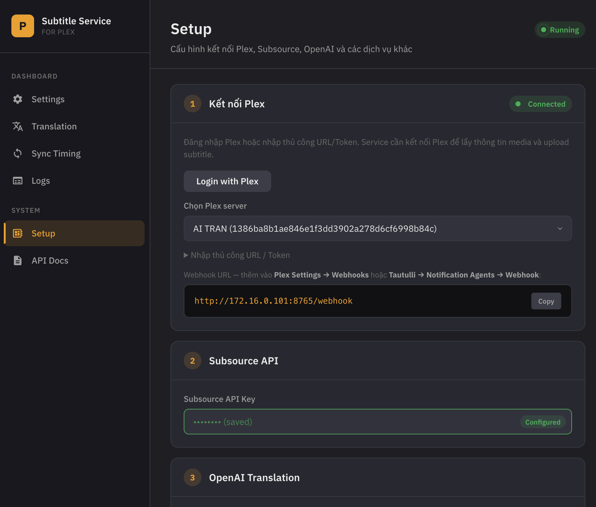

# Plex Subtitle Service

Tự động tìm, download, sync timing và dịch subtitle cho Plex Media Server.
Nhận webhook từ Plex hoặc Tautulli, tìm subtitle trên Subsource, upload thẳng vào Plex — không cần mount thư mục media.

```
Plex/Tautulli ──webhook──▶ Subtitle Service ──▶ Subsource (tìm + tải sub)
                                 │                       │
                                 ▼                       ▼
                           Plex API (upload)    OpenAI (sync / dịch sub)
```

## Tính năng

- **Auto-download** — tải và upload subtitle khi có media mới hoặc khi bắt đầu play
- **Multi-language** — hỗ trợ mọi ngôn ngữ trên Subsource, không chỉ tiếng Việt
- **Sync timing** — tự động căn chỉnh timing của sub theo bản gốc bằng AI
- **AI Translate** — dịch từ bất kỳ ngôn ngữ nguồn nào sang target lang (không chỉ EN→VI)
- **Translation approval** — chế độ yêu cầu duyệt trước khi dịch, tránh tốn API credits
- **Web UI** — setup wizard, settings, quản lý dịch thuật, xem log real-time
- **Telegram notifications** — thông báo download, sync, translate, lỗi
- **Quality filtering** — Retail > Translated > AI, threshold tùy chỉnh
- **Smart skip** — bỏ qua nếu đã có sub, nếu là embedded/image-based, nếu chất lượng đủ tốt

## Cài đặt nhanh

### Yêu cầu

- Docker & Docker Compose
- Plex Media Server (với Webhooks enabled — Plex Pass)
- Tài khoản [Subsource](https://subsource.net) + API key

### Docker Compose

```yaml
services:
  plex-subtitle-service:
    image: ghcr.io/leolionart/plex-sub-downloader:latest
    ports:
      - "8000:8000"
    volumes:
      - ./data:/app/data
    environment:
      - PLEX_URL=http://192.168.1.x:32400
      - PLEX_TOKEN=your_plex_token
      - SUBSOURCE_API_KEY=your_subsource_key
    restart: unless-stopped
```

```bash
docker compose up -d
```

### Cấu hình



1. Mở **http://your-server:8000/setup**
2. Nhập Plex URL, Plex Token, Subsource API Key
3. (Tuỳ chọn) Cấu hình OpenAI key để bật AI sync/translate
4. Lưu → kiểm tra kết nối

### Webhook

**Plex:** Settings → Webhooks → Add: `http://your-server:8000/webhook`

**Tautulli:** Notification Agents → Webhook → `http://your-server:8000/webhook`

- Trigger: Recently Added
- Payload: `{"event": "library.new", "rating_key": "{rating_key}", "media_type": "{media_type}"}`

## Web UI

| URL              | Chức năng                                  |
| ---------------- | -------------------------------------------- |
| `/`            | Settings — cấu hình download, AI, quality |
| `/setup`       | Setup wizard — credentials                  |
| `/sync`        | Manual sync/translate bất kỳ media         |
| `/translation` | Duyệt translation requests                  |
| `/logs`        | Log viewer real-time                         |

## Tài liệu

- [Architecture](docs/architecture.md) — thiết kế hệ thống, data flow, language logic
- [Features](docs/features.md) — mô tả chi tiết từng tính năng
- [Configuration](docs/configuration.md) — tất cả settings và env vars
- [API Reference](docs/api.md) — endpoints, request/response format
- [Development](docs/development.md) — local setup, project structure, contributing

## License

MIT — [leolionart](https://github.com/leolionart)
